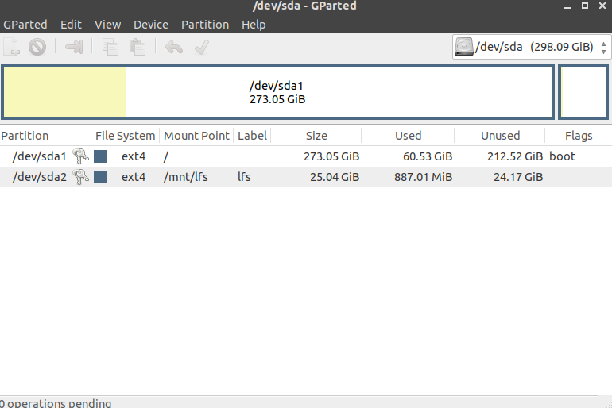

### Step by step procedure

#### Disclaimer: The procedure does not follow the LFS as it is and is just mere documentation of my attempt at building a minimal and a just enough OS. For instance the procedure below does not involve creating a swap partition as opposed to in the book. Although it does contains some direct inclusion of the book and would be quoted in blockquotes.

#### Creating a new Partition

 - Create a new partition with around 20GB of space with `ext4` as the file system type(Refer the screenshot below).



#### Setting the environment variable

`export LFS=/directory/to/mount`
 
For example, `export LFS=/mnt/lfs`

#### Mounting the newly created partiotion

`mkdir -pv $LFS`

`mount -v -t ext4 /dev/<xxx> $LFS`(use sudo)
  
  Here, `<xxx>` should be replaced with the partition name, which if referring to the earlier screenshot should be `sda2`

#### Downloading basic packages

 - Create a directory for storing all the tarballs and their unpacks with 
  
  `mkdir -v $LFS/sources`.
 - > Make this directory writable and sticky. “Sticky” means that even if multiple users have write permission on a directory,
only the owner of a file can delete the file within a sticky directory. The following command will enable the write
and sticky modes:

`chmod -v a+wt $LFS/sources`

Download the list of all packages from the downloads offered by lfs at http://www.linuxfromscratch.org/lfs/downloads/stable/ and run the following command to download all tarballs into the `sources` directory.

`wget --input-file=wget-list --continue --directory-prefix=$LFS/sources`

(Skipping verification of md5hash)

#### Review
Up till now you must have a `ext4` partition ready with a basic directory structure as follows with sources containing all the package tarballs:

```
drwx------ 2 root root 16384 Jan 13 17:40 lost+found/
drwxrwxrwt 2 root root  4096 Jan 18 00:31 sources/
-rw-r--r-- 1 root root  5299 Jan 13 18:02 wget-list

```

#### Creating tools directory

> The programs compiled here are temporary tools and will not be a part of the final LFS system.
By keeping these programs in a separate directory, they can easily be discarded later after their use. This also prevents
these programs from ending up in the host production directories

`mkdir -v $LFS/tools`

`ln -sv $LFS/tools /`

#### Creating a separate user group and user.

TODO: Add detailed description here.

#### Building different packages

 - Since we have all the tarballs in the `sources` directory, the next step is to build all packages.
 - While in the `sources` directory, the general process for all packages is as follows:
   - `tar -xJf <package.tar.xz>`
   - `mkdir -v build` (Creating a separate `build` directory is recommended)
   - `cd build`
   - `../configure`(Options are specific to package)
   - `make`
   - `make install`

#### Packages Installed

Following step by step instructions as given in the book.
